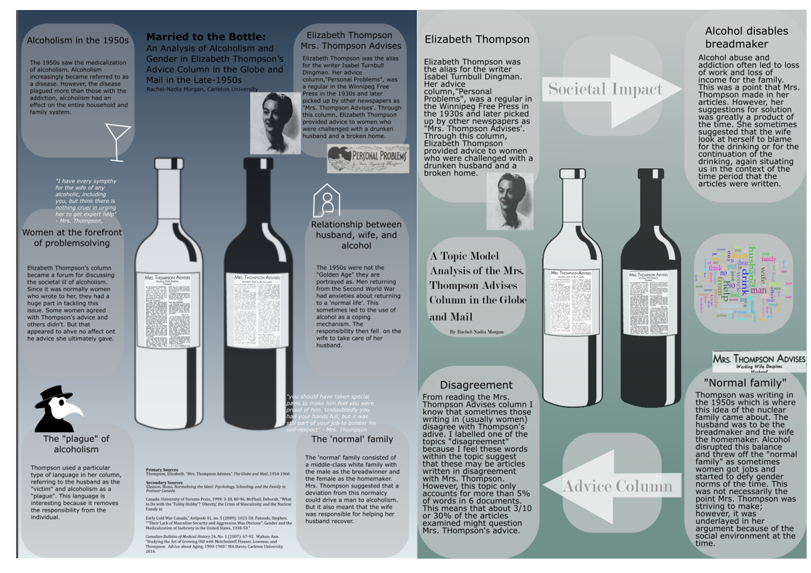

# Reflection for Week Six

This week I tied everything together and practiced some exploratory analysis int he cycle of digital history. Last week I created an academic poster on a paper I had written on the Mrs. Thompson Advises column in the Globe and Mail - particularily its discussion of alcohol in the 1950s. 
I decided that this week I was going to use the same column and conduct a digital analysis. I chose this column for two reasons: one, I am still a little unsure of some of the digital techniques therefore I thought that havinf a column I was interested in and familiar with could be helpful, and two, later I will conduct a comparative analysis of my results from my manual analysis which I demonstrated in the poster last week, and the digital results from this week. The purpose of this is to explore what we reflected on in week four of what might be missing from digital historical argumentation.

## Process

First, I will take you through the process of what I did this week.

I accessed the Globe and Mail database through MacOdrum library. In the advances search, I used the terms Mrs. Thompson Advises AND alcohol. After getting the results, I narrowed them down to the results from 1950-1959 - the same era I used for my manual analysis. I was left with 20 results. Each of the 20 columns I downloaded as a jpg file and saved it in its own folder. 

I then opened RStudio to use OCR to get a text file for each column. I proceeded to copy these text outputs into their own folder called input within a tmt folder.

I ran this input throguh the Topic Modelling Tool. With my results, I continuously went back and forth between the .cvs and the .html output. This process was time consuming and depending on howw much time I had to work on the project, I know I could have done a more in depth analysis of the topics. A shown in Moravec’s work, going back and forth is crucial to analyzing the questions before you even come to an answer. This process is very time consuming; she mentioned at the beginning of her post that she has ultimately been studying for 20 years. In the end, I decided on three topics that I was going to analyze in greater depth. I will talk about those results below.

Using my text file results from running an OCR, I copied the output text into an excel file to create a corpus of the columns. To each row I added the date and the title of the newspaper (Globe and Mail). I uploaded this text corpus to Voyant for a more visual analysis. In Voyant, I added many words to the stop list to weed out the jibberish of the unrecognizable words frm the OCR. I mostly made reference to the word cloud which I will talk about more below.

Finally, I decided to share my results using a poster format. I created this poster in Inkscape. I chose a poster because I felt that these documents led to an analysis that could be better understood visually. Also, as mentioned above, I wanted to compare the poster to the one I made regarding my manual analysis of thes columns.

## Results

In this section I will discuss the results I found from using the Topic Modelling Tool and Voyant. Through the Topic Modelling Tool I received results of 10 topics. For three topics I analyzed back and forth between the microscope and the macroscope. 

First, I would like to analyze Topic 1 which I labelled "Normal family". This topic is not the most prevalent in any document but it is underlying in all but 2 of the 20 documents. This demonstrates the importance of the context in which Mrs. Thompson was writing. She was writing in the 1950s which is where this idea of the nuclear family came about. The husband was to be the breadmaker and the wife the homemaker. Alcohol disrupted this balance and threw off the "normal family" as sometimes women got jobs and started to defy gender norms of the time. Shown by the presence of this topic, this was not necessarily the point Mrs. Thompson was striving to make; however, it was underlayed in her argument because of the social environment at the time.

This leads in to Topic 3: "Alcohol disables breadmaker". Alcohol abuse and addiction often led to loss of work and loss of income for the family. This was a point that Mrs. Thompson made in her articles. However, her suggestions for solution was greatly a product of the time. She sometimes suggested that the wife look at herself to blame for the drinking or for the continuation of the drinking, again situating us in the context of the time period that the articles were written.

Fianlly, From reading the Mrs. Thompson Advises column I know that sometimes those writing in (usually women) disagree with Thompson's adive. Topic 6 I labelled "disagreement" because I feel these words within the topic suggest that these may be articles written in disagreement with Mrs. Thompson. However, this topic (Topic 6) only accounts for more than 5% of words in 6 documents. This means that about 3/10 or 30% of the articles examined might question Mrs. Thompson's advice. When I read Moravec’s work this week I realized I could have taken this one step further. Topic Modelling suggests that these articles were written in disagreement with Mrs. Thompson; however, a more in depth search using AntConc would be useful in proving this point further.

When I went to use Voyant, I asked myself to look at the relationship between the words and how Thompson used language to describe this relationship between husband, wife, and alcohol. The word cloud was very useful for this. Some of the most prominant words are husband, drink, work, help, family, and home. When I go back and read Thompson's columns, these are often issues that women were writing in about.

## Comparison

Finally I would like to compare the results from this digital analysis to the manual analysis I have done of this column.

Below is the two posters - one from a manual analysis and one from a digital analysis - side by side.

Left: poster based on the manual analysis of the column. Full poster found here: https://github.com/rachelnadia/week-six/blob/master/poster2.svg
Right: poster based on the digital analysis of the column. Full poster found here: https://github.com/rachelnadia/week-six/blob/master/poster1.svg

