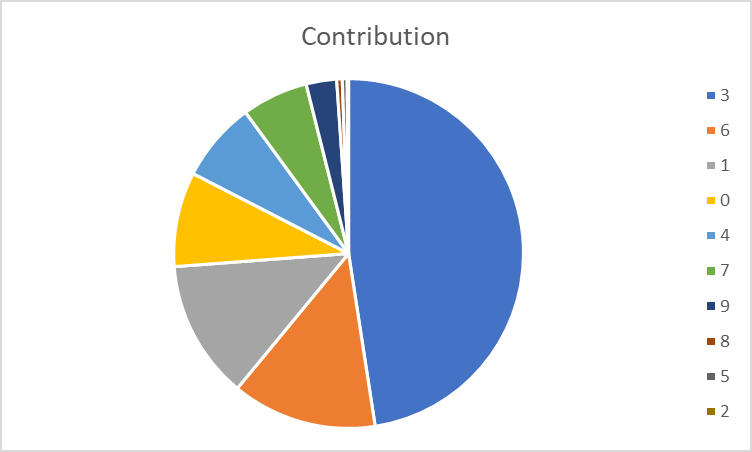
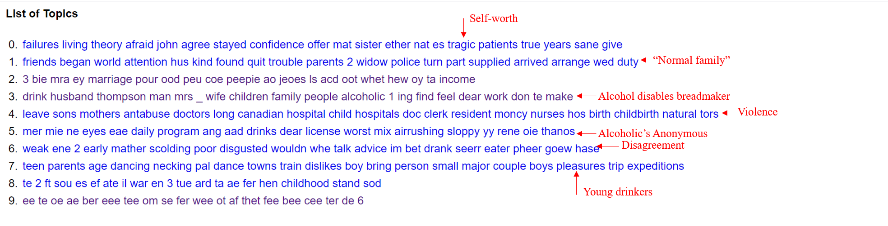

# Notes for Week 6

This week I am using the Mrs. Thompson Advises column in the Globe and Mail from 1950-1959 that returns the search word alcohol to examine the societal impacts of alcohol on family life.

First, I downloaded all the articles and OCR'd them in R to get txt files.
              
              # tell R which packages you need
             library(magick)             
             library(magrittr)                 
                 library(tesseract)                 
                 imgsource <- "many-pics"                 
                 myfiles <- list.files(path = imgsource, pattern = "png", full.names = TRUE)                   
                   lapply(myfiles, function(i){                   
                   text <- image_read(i) %>%                  
                  image_resize("3000x") %>%                   
                   image_convert(type = 'Grayscale') %>%                   
                   image_trim(fuzz = 40) %>%                   
                   image_write(format = 'png', density = '300x300') %>%
                   tesseract::ocr()                   
                   outfile <- paste(i,"-ocr.txt",sep="")
                   cat(text, file=outfile, sep="\n")
                  })

Then I ran them through the Topic Modelling Tool.
  (See: https://github.com/rachelnadia/week-six/tree/master/output_csv)

- Topic 3 was the most common in the majority of the documents

     3.	drink husband thompson man mrs _ wife children family people alcoholic 1 ing find feel dear work don te make
- From this topic, I make out that the columns deal with family issues surrounded the use of alcohol, such as the inability for the husband to find work
- Thus, I labelled this column as "alcohol disables breadmaker"

From reading the Mrs. Thompson Advises column I know that sometimes those writing in (usually women) disagree with Thompson's adive. Topic 6 I labelled "disagreement" because I feel these words within the topic suggest that these may be articles written in disagreement with Mrs. Thompson. However, this topic (Topic 6) only accounts for more than 5% of words in 6 documents. This means that about 3/10 or 30% of the articles examined might question Mrs. THompson's advice. 

